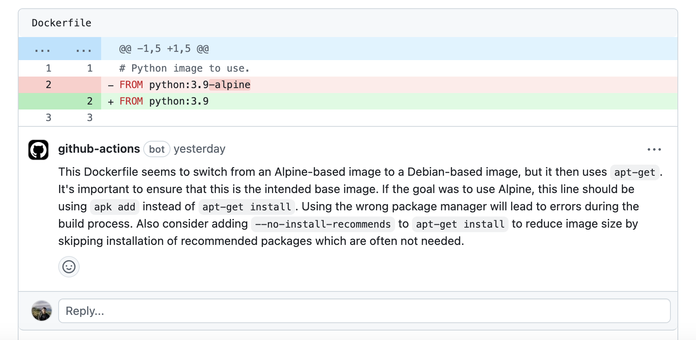

## Google Cloud credits are provided for this project `#VertexAISprint`
Thanks, [Google](https://github.com/google) :)

# Gemini AI Code Reviewer

A GitHub Action that automatically reviews pull requests using Google's Gemini AI.

## Features

- Review your PRs using Gemini API
- Give use comments and suggestions to improve the source codes



[Video Demo](https://www.youtube.com/watch?v=pc1ffEFMIQo)

## Setup

1. To use this GitHub Action, you need an Gemini API key. If you don't have one, sign up for an API key
   at [Google AI Studio](https://makersuite.google.com/app/apikey).

2. Add the Gemini API key as a GitHub Secret in your repository with the name `GEMINI_API_KEY`. You can find more
   information about GitHub Secrets [here](https://docs.github.com/en/actions/reference/encrypted-secrets).

3. Create a `.github/workflows/code-review.yml` file in your repository and add the following content:

### Option 1: Automatic Review on Pull Request Events (Recommended)

This configuration automatically triggers code review when a PR is opened, updated, or reopened:

```yaml
name: AI Code Reviewer

on:
  pull_request:
    branches: [ main ]

permissions:
  issues: write
  pull-requests: write
  contents: read

jobs:
  gemini-code-review:
    runs-on: ubuntu-latest
    steps:
      - name: PR Info
        run: |
          echo "PR Number: ${{ github.event.pull_request.number }}"
          echo "Repository: ${{ github.repository }}"
          echo "Head SHA: ${{ github.event.pull_request.head.sha }}"
          echo "Base SHA: ${{ github.event.pull_request.base.sha }}"

      - name: Checkout Repo
        uses: actions/checkout@v3
        with:
          fetch-depth: 0

      - name: Get PR Details
        id: pr
        run: |
          echo "head_sha=${{ github.event.pull_request.head.sha }}" >> $GITHUB_OUTPUT
          echo "base_sha=${{ github.event.pull_request.base.sha }}" >> $GITHUB_OUTPUT

      - uses: Thomasbehan/gemini-ai-code-reviewer@main
        with:
          GITHUB_TOKEN: ${{ secrets.GITHUB_TOKEN }}
          GEMINI_API_KEY: ${{ secrets.GEMINI_API_KEY }}
          GEMINI_MODEL: gemini-2.5-pro # Optional, default is `gemini-2.5-flash`
          EXCLUDE: "*.md,*.txt,package-lock.json,*.yml,*.yaml"
          SYSTEM_PROMPT: | # Optional: Custom system prompt for code reviews
            Review the code with the following guidelines:
            - Focus on security vulnerabilities and potential bugs
            - Check for proper error handling
            - Ensure code follows best practices
            - Verify performance considerations
```

### Option 2: Manual Trigger via Comment

This configuration requires manual triggering by commenting `/gemini-review` on a pull request:

```yaml
name: Gemini AI Code Reviewer

on:
  issue_comment:
    types: [created]

permissions: write-all

jobs:
  gemini-code-review:
    runs-on: ubuntu-latest
    if: |
      github.event.issue.pull_request &&
      contains(github.event.comment.body, '/gemini-review')
    steps:
      - name: PR Info
        run: |
          echo "Comment: ${{ github.event.comment.body }}"
          echo "Issue Number: ${{ github.event.issue.number }}"
          echo "Repository: ${{ github.repository }}"

      - name: Checkout Repo
        uses: actions/checkout@v3
        with:
          fetch-depth: 0

      - name: Get PR Details
        id: pr
        run: |
          PR_JSON=$(gh api repos/${{ github.repository }}/pulls/${{ github.event.issue.number }})
          echo "head_sha=$(echo $PR_JSON | jq -r .head.sha)" >> $GITHUB_OUTPUT
          echo "base_sha=$(echo $PR_JSON | jq -r .base.sha)" >> $GITHUB_OUTPUT
        env:
          GITHUB_TOKEN: ${{ secrets.GITHUB_TOKEN }}

      - uses: Thomasbehan/gemini-ai-code-reviewer@main
        with:
          GITHUB_TOKEN: ${{ secrets.GITHUB_TOKEN }}
          GEMINI_API_KEY: ${{ secrets.GEMINI_API_KEY }}
          GEMINI_MODEL: gemini-2.5-pro # Optional, default is `gemini-2.5-flash`
          EXCLUDE: "*.md,*.txt,package-lock.json,*.yml,*.yaml"
          SYSTEM_PROMPT: | # Optional: Custom system prompt for code reviews
            Review the code with the following guidelines:
            - Focus on security vulnerabilities and potential bugs
            - Check for proper error handling
            - Ensure code follows best practices
            - Verify performance considerations
```

## Configuration Options

### Required Parameters
- **GITHUB_TOKEN**: GitHub token to interact with the repository (automatically provided by GitHub Actions)
- **GEMINI_API_KEY**: Your Google Gemini API key (store this as a GitHub Secret)

### Optional Parameters
- **GEMINI_MODEL**: The Gemini model to use for code review (default: `gemini-2.5-flash`)
  - `gemini-2.5-flash` is a next-generation model offering speed and multimodal generation capabilities. It's suitable for a wide variety of tasks, including code generation, data extraction, and text editing.
  - For detailed information about available models, refer to [Gemini models](https://ai.google.dev/gemini-api/docs/models/gemini).
  
- **EXCLUDE**: Comma-separated list of file patterns to exclude from review (e.g., `*.md,*.txt,package-lock.json`)
  
- **SYSTEM_PROMPT**: Custom system prompt to define specific rules and guidelines for code reviews
  - If not provided, the action uses a default prompt based on best practices
  - Use this to customize the review focus (e.g., security-first, performance-focused, style-specific)
  - Example:
    ```yaml
    SYSTEM_PROMPT: |
      You are a senior code reviewer. Focus on:
      1. Security vulnerabilities (SQL injection, XSS, etc.)
      2. Performance bottlenecks
      3. Code maintainability and readability
      4. Proper error handling
      Do not comment on minor style issues.
    ```

4. Commit the workflow file to your repository.

5. Usage depends on which option you chose:
   - **Option 1 (Automatic)**: The code review will automatically run when you open, update, or reopen a pull request to the configured branch.
   - **Option 2 (Manual)**: Comment `/gemini-review` on any pull request to trigger the code review.

## How It Works

This GitHub Action uses the Gemini AI API to provide code review feedback. It works by:

1. **Analyzing the changes**: It grabs the code modifications from your pull request and filters out any files you don't want reviewed.
2. **Consulting the Gemini model**: It sends chunks of the modified code to the Gemini for analysis.
3. **Providing feedback**: Gemini AI examines the code and generates review comments.
4. **Delivering the review**: The Action adds the comments directly to your pull request on GitHub.

## License

This project is licensed under the MIT License. See the [LICENSE](LICENSE) file for more information.

## Star History ⭐️

[](https://star-history.com/#truongnh1992/gemini-ai-code-reviewer&Date)